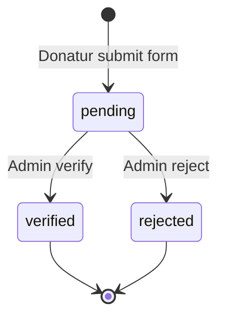

## Goal Capsule

- **Objective:** Aplikasi donasi online untuk satu lembaga — admin membuat campaign penggalangan dana, donatur transfer manual lalu upload bukti transfer, admin memverifikasi, donasi terverifikasi tampil publik.
- **Product authority:** Satu lembaga, satu role admin universal.
- **Stop conditions:** Semua acceptance examples AE1–AE6 lulus. Semua unit test scenarios terpenuhi.
- **Execution profile:** Greenfield Laravel 13 + SQLite. `composer run dev` untuk development. `php artisan test` untuk verifikasi.
- **Open blockers:** Tidak ada.

---

## Product Contract

### Summary

Aplikasi donasi online single-lembaga dengan konfirmasi transfer manual. Admin membuat campaign bertarget dana dan deadline, donatur anonim mentransfer lalu mengunggah bukti, admin memverifikasi. Setiap donasi mendapat token UUID untuk pelacakan status mandiri. Donasi terverifikasi langsung tampil di halaman campaign dengan progress bar dan daftar donatur publik.

### Problem Frame

Lembaga ingin menggalang dana secara online tanpa payment gateway. Donatur mentransfer manual ke rekening lembaga, lalu perlu mengkonfirmasi bahwa transfer sudah dilakukan. Saat ini belum ada sistem terpusat untuk menampilkan campaign, mencatat donasi, memverifikasi bukti transfer, dan menampilkan progres penggalangan dana ke publik secara transparan.

### Requirements

**Campaign**

- R1. Admin dapat membuat campaign penggalangan dana dengan: judul, deskripsi, gambar, target nominal, dan batas waktu (deadline).
- R2. Admin dapat mengedit dan menghapus campaign.
- R3. Banyak campaign dapat berjalan secara bersamaan.
- R4. Campaign otomatis berstatus selesai ketika target dana tercapai atau deadline terlewat — mana yang lebih dulu.
- R5. Campaign yang sudah selesai tidak menerima donasi baru. Form donasi disembunyikan atau dinonaktifkan.
- R6. Campaign menampilkan progress dana terkumpul (nominal + persentase terhadap target) dan sisa hari (jika belum deadline).

**Donasi**

- R7. Donatur dapat menyumbang tanpa login — cukup mengisi nama dan kontak (email atau nomor telepon).
- R8. Donatur dapat mengisi nominal donasi secara bebas (nominal kustom).
- R9. Donatur mengunggah bukti transfer (gambar) melalui form donasi di halaman campaign.
- R10. Setelah submit, donatur menerima token UUID unik dan URL untuk melacak status donasinya (pending/diverifikasi/ditolak).
- R11. Donasi yang sudah disubmit berstatus pending sampai diverifikasi admin.

**Verifikasi**

- R12. Admin melihat daftar donasi pending di dashboard dan dapat memverifikasi (terima/tolak) setiap donasi.
- R13. Admin dapat menambahkan catatan saat menolak donasi.
- R14. Donasi yang diverifikasi langsung tampil di halaman campaign — progress bar dan daftar donatur publik diperbarui.
- R15. Donasi yang ditolak tetap tercatat dengan status ditolak, tidak tampil di daftar donatur publik, dan tidak menambah progress.

**Pelacakan donasi**

- R16. Halaman publik `/cek/<token>` menampilkan status donasi: pending, diverifikasi, atau ditolak beserta detail donasi (campaign, nominal, nama, tanggal).
- R17. Token bersifat unik dan tidak dapat ditebak (UUID).

**Rekening tujuan**

- R18. Admin dapat mengatur satu atau beberapa rekening bank lembaga di halaman pengaturan.
- R19. Rekening yang diatur ditampilkan di setiap halaman campaign sebagai tujuan transfer.

**Halaman publik**

- R20. Homepage menampilkan daftar/grid campaign yang aktif, masing-masing dengan gambar, judul, progress bar, dan sisa hari.
- R21. Halaman detail campaign menampilkan: informasi campaign, rekening tujuan, form donasi (unggah bukti), progress bar, dan daftar donatur terverifikasi (nama dan nominal).
- R22. Campaign yang sudah selesai tetap dapat diakses, menampilkan hasil akhir penggalangan.

**Admin**

- R23. Admin login dengan kredensial email dan password.
- R24. Satu role admin universal — dapat mengelola campaign, memverifikasi donasi, dan mengatur rekening.
- R25. Dashboard admin menampilkan ringkasan: total donasi, jumlah campaign aktif, dan daftar donasi pending yang perlu diverifikasi.

### Key Decisions

- **Token lacak donasi (UUID) tanpa notifikasi email.** Donatur mendapat URL unik untuk cek status sendiri. Menghindari ketergantungan pada SMTP/queue untuk v1, namun tetap memberi transparansi. Notifikasi email dapat ditambahkan kemudian di atas infrastruktur token yang sudah ada.
- **Satu rekening bank untuk semua campaign.** Dikelola admin di pengaturan, ditampilkan di setiap halaman campaign. Menyederhanakan setup dan rekonsiliasi.
- **Satu role admin universal.** Seluruh admin memiliki hak akses yang sama: kelola campaign dan verifikasi donasi. Pembagian role (pengelola campaign vs bendahara) di luar scope v1.
- **Donatur anonim (tanpa autentikasi).** Menurunkan friksi untuk donatur. Data diri minimal: nama dan kontak (email/telepon).

### Key Flows

- F1. Donatur menyumbang
  - **Trigger:** Donatur membuka halaman campaign dan mengisi form donasi.
  - **Actors:** Donatur (anonim), Sistem, Admin
  - **Steps:**
    1. Donatur mengisi nama, kontak, nominal donasi, dan mengunggah gambar bukti transfer.
    2. Sistem menyimpan donasi dengan status pending dan menghasilkan token UUID.
    3. Sistem menampilkan halaman konfirmasi berisi token dan URL pelacakan.
    4. Admin membuka dashboard, melihat donasi pending, dan memverifikasi (terima/tolak).
    5. Jika diterima: donasi tampil di halaman campaign, progress bertambah. Jika ditolak: donasi tercatat ditolak, tidak tampil publik.
  - **Covered by:** R7–R15, R16–R17

- F2. Campaign berakhir otomatis
  - **Trigger:** Target dana tercapai atau deadline terlewat.
  - **Actors:** Sistem
  - **Steps:**
    1. Pada setiap donasi terverifikasi, sistem mengecek apakah total dana terkumpul ≥ target.
    2. Sistem juga mengecek apakah tanggal saat ini > deadline campaign.
    3. Jika salah satu kondisi terpenuhi, campaign berstatus selesai.
    4. Form donasi pada campaign yang selesai dinonaktifkan.
  - **Covered by:** R4, R5

- F3. Donatur melacak donasi
  - **Trigger:** Donatur membuka URL `/cek/<token>`.
  - **Actors:** Donatur (anonim)
  - **Steps:**
    1. Donatur mengakses URL yang diterima saat submit donasi.
    2. Sistem menampilkan status donasi (pending/diverifikasi/ditolak) beserta detail: campaign, nominal, nama donatur, tanggal donasi, dan catatan jika ditolak.
  - **Covered by:** R16–R17

### Acceptance Examples

- AE1. Donasi terverifikasi menambah progress
  - **Covers:** R14
  - **Given:** Campaign "Bantu Korban Banjir" dengan target Rp 10.000.000 dan dana terkumpul saat ini Rp 2.000.000 (20%).
  - **When:** Admin memverifikasi donasi baru sebesar Rp 500.000.
  - **Then:** Progress campaign menjadi Rp 2.500.000 (25%), dan donasi muncul di daftar donatur publik.

- AE2. Donasi ditolak tidak mempengaruhi progress
  - **Covers:** R15
  - **Given:** Campaign dengan dana terkumpul Rp 2.000.000.
  - **When:** Admin menolak donasi pending sebesar Rp 500.000.
  - **Then:** Dana terkumpul tetap Rp 2.000.000, dan donasi tidak muncul di daftar donatur publik.

- AE3. Campaign otomatis selesai saat target tercapai
  - **Covers:** R4
  - **Given:** Campaign dengan target Rp 5.000.000, dana terkumpul Rp 4.500.000, deadline masih 10 hari lagi.
  - **When:** Admin memverifikasi donasi sebesar Rp 500.000.
  - **Then:** Campaign berstatus selesai, form donasi dinonaktifkan.

- AE4. Campaign otomatis selesai saat deadline lewat
  - **Covers:** R4
  - **Given:** Campaign dengan target Rp 10.000.000, dana terkumpul Rp 3.000.000, deadline hari ini.
  - **When:** Tanggal berganti melewati deadline.
  - **Then:** Campaign berstatus selesai meskipun target belum tercapai.

- AE5. Token donasi menampilkan status akurat
  - **Covers:** R16
  - **Given:** Donasi dengan token `a1b2c3d4-...` berstatus pending.
  - **When:** Admin memverifikasi donasi tersebut, lalu donatur membuka `/cek/a1b2c3d4-...`.
  - **Then:** Halaman menampilkan status "Diverifikasi" dan detail donasi.

- AE6. Campaign selesai tidak menerima donasi baru
  - **Covers:** R5
  - **Given:** Campaign berstatus selesai.
  - **When:** Pengunjung membuka halaman campaign.
  - **Then:** Form donasi tidak ditampilkan atau dinonaktifkan dengan pesan bahwa campaign telah berakhir.

### Scope Boundaries

- **Deferred for later:**
  - Notifikasi email/WhatsApp ke donatur saat donasi diverifikasi.
  - Pembayaran otomatis via payment gateway (Midtrans, Xendit, dll).
  - Multi-role admin (pengelola campaign vs bendahara verifikasi).
  - Login donatur / akun donatur dengan riwayat donasi.
  - Halaman donasi yang bisa dibagikan sebagai "tanda terima digital" yang dipersonalisasi.
  - Target donasi bertingkat (milestone-based).

- **Outside this product's identity:**
  - Crowdfunding dengan reward tier (seperti Kitabisa).
  - Multi-lembaga / platform donasi umum.

### Success Criteria

- Donatur anonim dapat menyumbang dalam ≤ 3 langkah: isi data → unggah bukti → dapat token.
- Admin dapat memverifikasi donasi dalam satu klik dari dashboard.
- Progress campaign selalu akurat — tidak ada selisih antara donasi terverifikasi dan dana yang ditampilkan.
- Campaign otomatis berhenti menerima donasi saat target tercapai atau deadline lewat, tanpa perlu intervensi admin.

---

## Planning Contract

### Key Technical Decisions

- **Campaign auto-close via accessor, not scheduled command.** Status campaign dihitung secara lazy melalui accessor `is_completed` yang mengecek deadline dan perbandingan total donasi terverifikasi vs target. Ini menghindari race condition scheduling dan lebih sederhana. Konsekuensi: setiap kali status campaign ditampilkan, query aggregate berjalan (ringan, karena total donasi di-cache di level aplikasi atau bisa di-indexed).
- **Donation status enum backed by string column.** Status donasi: `pending`, `verified`, `rejected`. Pakai string column dengan validasi di level aplikasi (tidak perlu native MySQL enum untuk SQLite compatibility).
- **Token UUID generated via Eloquent `creating` event.** Donasi mendapat token UUID4 di event `creating` model, dipastikan unique sebelum insert.
- **File upload ke `storage/app/public/donations/`.** Bukti transfer disimpan di disk `public` dengan symlink `php artisan storage:link`. File divalidasi sebagai gambar (mimes: jpg,png,jpeg) dengan maksimal 2MB.
- **Campaign image opsional disimpan di disk public `campaigns/`.** Campaign bisa dibuat tanpa gambar; gambar ditampilkan sebagai fallback placeholder di view.
- **Admin auth via Laravel session guard, bukan API token.** Admin login menggunakan session-based auth Laravel standar. Middleware `auth` melindungi route prefix `/admin/*`. Tidak ada API layer untuk v1.
- **Rekening bank disimpan di model `BankAccount` (bukan config file).** Admin bisa CRUD rekening via UI. Data ditampilkan di halaman campaign. Multiple bank accounts didukung dari awal.
- **Campaign slug otomatis dari judul.** Menggunakan `Str::slug()` dengan fallback unique constraint. Slug dipakai di URL publik (`/campaign/{slug}`).

### High-Level Technical Design

**Data model:**

```mermaid
erDiagram
    Campaign {
        string title
        string slug UK
        text description
        string image_path nullable
        int target_amount
        date deadline
        timestamps
    }
    Donation {
        uuid token UK
        string donor_name
        string donor_email nullable
        string donor_phone nullable
        int amount
        string proof_image_path
        string status "pending|verified|rejected"
        text admin_notes nullable
        timestamp verified_at nullable
        timestamps
    }
    BankAccount {
        string bank_name
        string account_name
        string account_number
        timestamps
    }
    Campaign ||--o{ Donation : "has many"
```

**Route structure:**

```
Public:
  GET   /                          → campaign listing (homepage)
  GET   /campaign/{slug}           → campaign detail + donation form
  POST  /campaign/{slug}/donation  → submit donation
  GET   /cek/{token}               → donation tracking

Admin:
  GET   /admin/login               → login form
  POST  /admin/login               → login action
  POST  /admin/logout              → logout
  GET   /admin/dashboard           → dashboard
  GET   /admin/campaigns           → campaign list
  GET   /admin/campaigns/create    → create form
  POST  /admin/campaigns           → store campaign
  GET   /admin/campaigns/{id}/edit → edit form
  PUT   /admin/campaigns/{id}      → update campaign
  DELETE /admin/campaigns/{id}     → delete campaign
  GET   /admin/donations           → donation list (filterable by status)
  POST  /admin/donations/{id}/verify   → verify donation
  POST  /admin/donations/{id}/reject   → reject donation (with notes)
  GET   /admin/bank-accounts       → bank account list
  POST  /admin/bank-accounts       → store bank account
  PUT   /admin/bank-accounts/{id}  → update bank account
  DELETE /admin/bank-accounts/{id} → delete bank account
```

**Verification workflow:**



### Sources / Research

- `composer.json` — Laravel 13, PHP 8.3, SQLite, no additional packages needed.
- Existing migrations: `users`, `cache`, `jobs` — standard skeleton. `users` table reused for admin auth.
- `config/filesystems.php` — `default` disk `local`, can symlink `public` for donation proof images.
- No existing controllers beyond `Controller.php` base class.
- No existing views beyond `welcome.blade.php`.

---

## Implementation Units

### U1. Database: Migrations & Models

- **Goal:** Create the three core database tables and Eloquent models with relationships, factories, and seeders.
- **Requirements:** R1 (campaign fields), R4 (deadline target), R7 (donor fields), R8 (amount), R9 (proof image), R10 (token UUID), R11 (status), R13 (admin notes), R14 (verified_at), R17 (UUID), R18 (bank account fields)
- **Files:**
  - `database/migrations/YYYY_MM_DD_HHMMSS_create_campaigns_table.php` (create)
  - `database/migrations/YYYY_MM_DD_HHMMSS_create_donations_table.php` (create)
  - `database/migrations/YYYY_MM_DD_HHMMSS_create_bank_accounts_table.php` (create)
  - `app/Models/Campaign.php` (create)
  - `app/Models/Donation.php` (create)
  - `app/Models/BankAccount.php` (create)
  - `database/factories/CampaignFactory.php` (create)
  - `database/factories/DonationFactory.php` (create)
  - `database/factories/BankAccountFactory.php` (create)
  - `database/seeders/DatabaseSeeder.php` (modify)
  - `tests/Feature/Models/CampaignTest.php` (create)
  - `tests/Feature/Models/DonationTest.php` (create)
- **Approach:**
  - `campaigns`: `id`, `title`, `slug` (unique), `description` (text, nullable), `image_path` (nullable), `target_amount` (unsigned big integer), `deadline` (date), `timestamps`
  - `donations`: `id`, `campaign_id` (foreign key), `token` (uuid, unique), `donor_name`, `donor_email` (nullable), `donor_phone` (nullable), `amount` (unsigned big integer), `proof_image_path`, `status` (string, default 'pending'), `admin_notes` (text, nullable), `verified_at` (timestamp, nullable), `timestamps`
  - `bank_accounts`: `id`, `bank_name`, `account_name`, `account_number`, `timestamps`
  - Models: `Campaign` hasMany `Donation`; `Donation` belongsTo `Campaign`. `Donation` uses `HasUuids` trait? No — manual UUID generation via `creating` event with `Str::orderedUuid()` to keep it index-friendly.
  - `Campaign` has computed accessor `isCompleted()` that checks `deadline < now() || total_verified_amount >= target_amount`.
  - `Campaign` has accessor `totalVerifiedAmount()` that sums related donations with `status = 'verified'`.
  - `Donation` auto-generates `token` via `static::creating()` using `Str::orderedUuid()->toString()`.
  - Factories: `CampaignFactory` with random `title`, `target_amount`, `deadline`; `DonationFactory` with states `pending()`, `verified()`, `rejected()`; `BankAccountFactory` with faker bank data.
  - Seeder: `DatabaseSeeder` calls `CampaignFactory` and `BankAccountFactory` for development. Default admin user seeded.
- **Patterns to follow:** Laravel 13 model conventions — PHP attributes for `Fillable`, `HasFactory` trait, foreign key constraints in migrations.
- **Test scenarios:**
  - Covers AE6. Campaign `isCompleted` returns true when deadline passed.
  - Campaign `isCompleted` returns true when total verified amount ≥ target.
  - Campaign `isCompleted` returns false when target not met and deadline not passed.
  - `Donation` auto-generates a unique UUID token on creation.
  - `Donation` factory `verified()` state sets status and verified_at correctly.
  - `Campaign::totalVerifiedAmount()` returns sum of verified donations only.
- **Verification:** Migrations run without errors. Models pass basic relationship and accessor tests.

---

### U2. Admin Authentication

- **Goal:** Admin login/logout using Laravel session auth. Protect admin routes with middleware.
- **Requirements:** R23, R24
- **Dependencies:** U1
- **Files:**
  - `app/Http/Controllers/Admin/AuthController.php` (create)
  - `resources/views/admin/login.blade.php` (create)
  - `app/Http/Middleware/AdminMiddleware.php` (create, optional — `auth` middleware is sufficient)
  - `routes/web.php` (modify)
  - `tests/Feature/Admin/AuthTest.php` (create)
- **Approach:**
  - Standard Laravel session auth. User model (`app/Models/User`) already exists with `email` and `password` fields from skeleton migration.
  - `AuthController` with `showLoginForm()`, `login(Request)`, `logout()`.
  - `login()` validates email + password with `Auth::attempt()`, regenerates session on success.
  - Admin routes wrapped in `Route::middleware('auth')->prefix('admin')->group(...)`.
  - Login page: simple centered form with email, password, and "Login" button.
  - No registration page — admin account created via seeder or tinker.
- **Patterns to follow:** Laravel `Auth::attempt()`, `auth()` guard, session regeneration.
- **Test scenarios:**
  - Admin can login with valid credentials.
  - Admin cannot login with invalid credentials.
  - Authenticated admin can access `/admin/dashboard` (placeholder or redirect for now).
  - Guest redirected to login when accessing `/admin/*`.
  - Admin can logout and is redirected to login.
- **Verification:** Admin login/logout flow works. Protected routes redirect unauthenticated users.

---

### U3. Admin: Bank Account Management

- **Goal:** CRUD interface for managing destination bank accounts in the admin panel.
- **Requirements:** R18, R19
- **Dependencies:** U2
- **Files:**
  - `app/Http/Controllers/Admin/BankAccountController.php` (create)
  - `resources/views/admin/bank-accounts/index.blade.php` (create)
  - `resources/views/admin/bank-accounts/create.blade.php` (create)
  - `resources/views/admin/bank-accounts/edit.blade.php` (create)
  - `routes/web.php` (modify)
  - `tests/Feature/Admin/BankAccountTest.php` (create)
- **Approach:**
  - Resourceful controller for `BankAccount` model.
  - `index()`: list all bank accounts in a table.
  - `create()` / `store()`: form with bank_name, account_name, account_number. Validate all fields required.
  - `edit()` / `update()`: same form, pre-filled.
  - `destroy()`: delete with confirmation.
  - Simple Blade views with Tailwind styling (dark/light neutral).
  - Form request or inline `$request->validate()`.
- **Patterns to follow:** Resource controller, validation, flash messages with `session()->flash()`.
- **Test scenarios:**
  - Admin can create a new bank account.
  - Admin can update an existing bank account.
  - Admin can delete a bank account.
  - Validation fails when bank name is empty.
  - Guest cannot access bank account routes.
- **Verification:** Admin can CRUD bank accounts. Bank accounts appear in database correctly.

---

### U4. Admin: Campaign Management

- **Goal:** CRUD interface for campaigns with image upload. Dashboard summary with stats.
- **Requirements:** R1, R2, R6 (via admin create/edit), R25 (dashboard stats)
- **Dependencies:** U2
- **Files:**
  - `app/Http/Controllers/Admin/CampaignController.php` (create)
  - `app/Http/Controllers/Admin/DashboardController.php` (create)
  - `app/Http/Requests/StoreCampaignRequest.php` (create)
  - `app/Http/Requests/UpdateCampaignRequest.php` (create)
  - `resources/views/admin/dashboard.blade.php` (create)
  - `resources/views/admin/campaigns/index.blade.php` (create)
  - `resources/views/admin/campaigns/create.blade.php` (create)
  - `resources/views/admin/campaigns/edit.blade.php` (create)
  - `routes/web.php` (modify)
  - `tests/Feature/Admin/CampaignTest.php` (create)
- **Approach:**
  - `DashboardController::index()`: query total verified donations sum, count of active campaigns (deadline > now, target not reached), latest pending donations.
  - `CampaignController`: resource CRUD. `store()` and `update()` auto-generate slug via `Str::slug($request->title)`, append random suffix if duplicate.
  - Image upload: store to `storage/app/public/campaigns/`, save path to `image_path`. Validate mimes:jpg,png,jpeg, max:2048.
  - `index()`: table listing with status badge (active/completed) and progress percentage.
  - `create()` / `edit()`: form with title, description (textarea), target_amount (number), deadline (date), image (file, optional).
  - `destroy()`: delete with confirmation, optionally delete image file from storage.
  - Run `php artisan storage:link` as part of setup.
- **Patterns to follow:** Form requests for validation, `Storage::disk('public')` for uploads, `Str::slug()` for sluggification.
- **Test scenarios:**
  - Admin can create a campaign with all fields filled.
  - Admin can create a campaign without image.
  - Admin can update a campaign.
  - Admin can delete a campaign.
  - Slug is auto-generated from title and is unique.
  - Validation fails when title or target amount is empty.
  - Dashboard shows total verified donations and active campaign count correctly.
  - Guest cannot access admin campaign routes.
- **Verification:** Admin CRUD for campaigns works. Dashboard stats reflect database state.

---

### U5. Admin: Donation Verification

- **Goal:** Admin views list of donations with status filter, verifies or rejects them. Auto-close campaign when target reached.
- **Requirements:** R4, R12, R13, R14, R15
- **Dependencies:** U4 (campaigns must exist), U1 (donation model)
- **Files:**
  - `app/Http/Controllers/Admin/DonationController.php` (create)
  - `resources/views/admin/donations/index.blade.php` (create)
  - `resources/views/admin/donations/show.blade.php` (create)
  - `routes/web.php` (modify)
  - `tests/Feature/Admin/DonationVerificationTest.php` (create)
- **Approach:**
  - `index()`: paginated list with status filter (all, pending, verified, rejected). Sort by created_at desc.
  - `show()`: donation detail with donor info, amount, proof image (displayed inline), and verification action buttons.
  - `verify(Donation $donation)`: set status = 'verified', verified_at = now(), save. Check if campaign target reached — no explicit status change needed because `isCompleted` is computed inline. Only log that campaign is automatically complete in admin notes.
  - `reject(Request $request, Donation $donation)`: validate `admin_notes` required, set status = 'rejected', save.
  - Show proof image as a thumbnail that expands on click.
  - Campaign completion logic: since `isCompleted` is computed accessor, no explicit status field change needed. The accessor already checks `total_verified_amount >= target_amount || deadline < now()`. The donation form in U7 checks `isCompleted()` before displaying. This is the simplicity of the accessor-based approach.
- **Patterns to follow:** Pagination, route model binding, inline image display with Laravel `Storage::url()`.
- **Test scenarios:**
  - Covers AE1. Admin verifies donation → status is `verified`, `verified_at` is set.
  - Covers AE2. Admin rejects donation → status is `rejected`, `admin_notes` saved.
  - Covers AE3. Admin verifies donation that makes total reach target → campaign's `isCompleted()` returns true.
  - Donation listing filtered by status shows correct results.
  - Cannot verify an already-verified donation (idempotent or validation guard).
  - Reject requires admin_notes.
  - Guest cannot access admin donation routes.
- **Verification:** Admin verify/reject flow works end-to-end. Status changes persist. Campaign auto-completes when target reached.

---

### U6. Public: Campaign Listing & Detail

- **Goal:** Homepage displays active campaign grid. Detail page shows campaign info, bank accounts, and list of verified donors.
- **Requirements:** R3, R6, R19, R20, R21, R22
- **Dependencies:** U3 (bank accounts exist), U4 (campaigns exist), U1
- **Files:**
  - `app/Http/Controllers/CampaignController.php` (create)
  - `resources/views/campaigns/index.blade.php` (create)
  - `resources/views/campaigns/show.blade.php` (create)
  - `resources/views/components/campaign-card.blade.php` (create)
  - `routes/web.php` (modify)
  - `tests/Feature/Public/CampaignPageTest.php` (create)
- **Approach:**
  - `index()`: query campaigns where `isCompleted()` is false (or all, with completed shown separately). Show as responsive card grid — each card shows image (or placeholder), title, progress bar (percentage bar), remaining days, target amount, and "Donasi" button.
  - `show($slug)`: find campaign by slug. Show title, description, image, progress bar, remaining days, list of bank accounts (from BankAccount model), and list of verified donations (donor name + amount, newest first). If campaign is completed, show "Campaign selesai" banner and hide donation form.
  - Progress bar: HTML/CSS inline. Percentage = (total_verified_amount / target_amount * 100) capped at 100.
  - Remaining days: `max(0, now()->diffInDays($campaign->deadline, false))` or "Selesai" if completed.
  - Use `Storage::url()` for campaign images and bank account info in simple cards.
- **Patterns to follow:** Route model binding with `slug`, eager loading `donations` for verified list, `->with('donations')` relationship.
- **Test scenarios:**
  - Covers AE6. Campaign detail page shows form only when campaign is not completed.
  - Homepage shows active campaigns with correct progress and days remaining.
  - Completed campaigns are accessible and show final results.
  - Campaign detail shows verified donors list (name + amount).
  - Campaign detail shows bank account information.
  - Campaign with 0 donations shows 0% progress and full target.
- **Verification:** Public pages render campaign grid and detail with correct data. Progress bar math is accurate.

---

### U7. Public: Donation Submission

- **Goal:** Donation form on campaign detail page — donor fills name, contact, amount, uploads proof, gets token URL.
- **Requirements:** R5, R7, R8, R9, R10, R11
- **Dependencies:** U6 (campaign detail page exists), U1
- **Files:**
  - `app/Http/Controllers/DonationController.php` (create)
  - `app/Http/Requests/StoreDonationRequest.php` (create)
  - `resources/views/donations/confirmation.blade.php` (create)
  - `resources/views/campaigns/show.blade.php` (modify — add form)
  - `routes/web.php` (modify)
  - `tests/Feature/Public/DonationSubmissionTest.php` (create)
- **Approach:**
  - Form in campaign detail page: fields for `donor_name` (required), `donor_email` (nullable, email), `donor_phone` (nullable), `amount` (required, numeric, min: 1000), `proof_image` (required, image, mimes:jpg,png,jpeg, max: 2048).
  - `DonationController::store(StoreDonationRequest $request, Campaign $campaign)`: validate campaign not completed (R5). Create Donation record with status `pending`. Upload proof to `storage/app/public/donations/`. Token auto-generated by model `creating` event. Redirect to confirmation page.
  - Confirmation page: "Terima kasih! Donasi Anda sedang menunggu verifikasi." Show token and URL `/cek/{token}`. Suggest donor saves or bookmarks the link.
  - Amount is stored as integer in IDR (rupiah).
  - File validation uses `image` rule which validates actual image content, not just extension.
- **Patterns to follow:** Form requests for clean validation, `Storage::disk('public')->putFile()`, `Str::orderedUuid()` via model event.
- **Test scenarios:**
  - Covers AE6. Cannot submit donation to completed campaign — returns validation error.
  - Donor submits valid donation → 302 redirect to confirmation, donation saved with pending status.
  - Donation has unique token generated.
  - Proof image is stored and accessible via `Storage::url()`.
  - Validation fails when donor_name is empty.
  - Validation fails when amount is below minimum (1000).
  - Validation fails when proof_image is not an image file.
  - Confirmation page displays token URL correctly.
- **Verification:** Donation form submits correctly. Token generated and displayed. Proof image stored.

---

### U8. Public: Donation Tracking Page

- **Goal:** Public page at `/cek/{token}` showing donation status and details.
- **Requirements:** R16, R17
- **Dependencies:** U7 (donations exist with tokens)
- **Files:**
  - `app/Http/Controllers/DonationTrackingController.php` (create)
  - `resources/views/donations/track.blade.php` (create)
  - `routes/web.php` (modify)
  - `tests/Feature/Public/DonationTrackingTest.php` (create)
- **Approach:**
  - `DonationTrackingController::show($token)`: find donation by token or 404. Eager load campaign.
  - Display: status badge (pending: yellow, verified: green, rejected: red), donor name, amount (formatted IDR), campaign title (linked), donation date. If rejected, show admin_notes.
  - If verified, show verification date.
  - Clean, simple page — no auth required.
  - `route('donation.track', $token)` for URL generation.
- **Patterns to follow:** Route model binding alternative — `Donation::where('token', $token)->firstOrFail()`.
- **Test scenarios:**
  - Covers AE5. Valid token shows donation status and details.
  - Invalid token returns 404.
  - Pending donation shows "Menunggu Verifikasi" status.
  - Verified donation shows "Diverifikasi" status with verification date.
  - Rejected donation shows "Ditolak" status with admin notes.
- **Verification:** Token tracking page works for all three statuses. 404 for invalid tokens.

---

### U9. Polish: Navigation, Layout, and Styling

- **Goal:** Consistent layout across public and admin pages. Responsive design with Tailwind CSS. Admin navigation sidebar or topbar.
- **Requirements:** R20 (clean grid), R21 (detail layout)
- **Dependencies:** U2–U8
- **Files:**
  - `resources/views/layouts/app.blade.php` (create — public layout)
  - `resources/views/layouts/admin.blade.php` (create — admin layout)
  - `resources/views/components/navbar.blade.php` (create)
  - `resources/views/components/admin-sidebar.blade.php` (create)
  - `resources/css/app.css` (modify — Tailwind import if needed)
  - `resources/views/welcome.blade.php` (modify — redirect to `/` or repurpose)
- **Approach:**
  - Public layout: simple top navbar with app name/logo (links to `/`). Clean footer. Responsive grid for campaign cards.
  - Admin layout: sidebar navigation with links (Dashboard, Campaigns, Donations, Bank Accounts, Logout). Main content area.
  - Campaign cards: Tailwind card component with image, title, progress bar, stats row (dana terkumpul / target, sisa hari).
  - Mobile responsive: cards stack to single column. Admin sidebar collapses to hamburger.
  - Donation confirmation page: centered card with success icon, token, and copy-paste friendly URL.
  - Use Tailwind utility classes throughout — no custom CSS unless necessary.
- **Patterns to follow:** Blade component system, Tailwind utility-first CSS, `@vite` for assets.
- **Test scenarios:** Test expectation: visual/manual review — verify pages render without errors and are responsive at mobile/desktop widths. No automated layout tests.
- **Verification:** All pages render with consistent layout. Admin sidebar navigates correctly. Responsive on mobile.

---

## Verification Contract

| Command | Purpose |
|---|---|
| `php artisan test --compact` | Run all feature tests |
| `php artisan test --compact --filter=Campaign` | Test campaign-related features |
| `php artisan test --compact --filter=Donation` | Test donation-related features |
| `php artisan test --compact --filter=Admin` | Test admin features |
| `php artisan migrate:fresh --seed` | Reset DB and seed for manual verification |
| `composer run dev` | Start dev server, queue, logs, and Vite concurrently |

- Verify `php artisan storage:link` has been run so uploaded images are accessible.
- All tests must pass before considering any unit complete.
- Manual verification: complete a full donation flow end-to-end (browse campaigns, submit donation, login as admin, verify donation, check tracking page, check campaign progress).

---

## Definition of Done

- All migrations run without errors on fresh database.
- All feature tests pass (`php artisan test --compact`).
- Full donation flow works manually: browse → submit → verify → track.
- Campaign auto-completes when target reached or deadline passed.
- Admin cannot access without login. Guest cannot access admin routes.
- Proof images are uploaded, stored, and displayed correctly.
- `Product Contract` unchanged — all R1–R25 satisfied.
