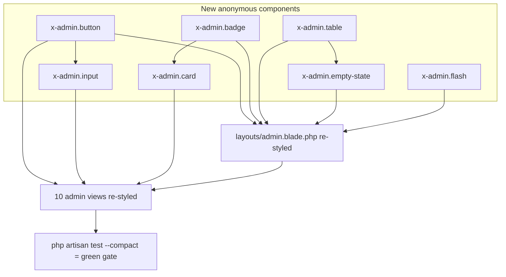

## Goal Capsule

- **Objective:** Refactor admin panel visual layer into shadcn-styled Blade anonymous components, removing hand-repeated Tailwind utility strings across 10 admin views. No behavior change, no new features, no public-facing area touched.
- **Product authority:** Single-lembaga admin (one universal role) — same admin who already logs in today.
- **Stop conditions:** All 10 admin views consume the new components with no duplicated utility strings; `php artisan test --compact` stays green; manual review confirms consistent look across dashboard/campaign/donation/bank-account pages.
- **Open blockers:** None.

---

## Product Contract

### Summary

Extract the repeated button, input, badge, card, table, and empty-state Tailwind patterns out of the 10 admin Blade views into `resources/views/components/admin/*` anonymous components styled in the shadcn look-and-feel (neutral palette, subtle borders, soft shadows, clean spacing). Restyle the sidebar layout and standalone login page to match. Controllers and data contracts stay untouched.

### Problem Frame

The donation platform's admin panel works end-to-end but ships visuals hand-rolled per-view. Every button, input, status badge, table, and empty state re-types its own Tailwind utility string, so the 10 views drift in spacing, shadow depth, status color, and font weight even when they show the same logical element. A status badge reads `bg-amber-100 text-amber-700` on one page and a different amber shade on another; primary buttons vary between `bg-indigo-600` and `bg-indigo-500` hover. Touching one visual pattern means finding and editing every repetition. There is no component layer to edit once and affect everywhere — `resources/views/components/campaign-card.blade.php` is the only Blade component and it serves the public side. The carrying cost is low today but compounds with each new admin view.

### Key Decisions

- **shadcn look-and-feel in Blade, not shadcn/ui proper.** The repo is Blade + Tailwind v4 with zero JS infrastructure (`resources/js/app.js` is empty, no React/Vue/Alpine). Porting shadcn's design language as anonymous Blade components keeps the stack unchanged and avoids maintaining a second ecosystem. Rejected Inertia+React migration as disproportionate carrying cost for a single-lembaga admin tool.
- **Components live under `components/admin/*`, not shared `components/*`.** The public side (homepage, campaign detail, donation tracking, confirmation) is explicitly untouched to keep its flow at zero risk. A `components/admin` namespace separates the new system from the public-only `campaign-card` and makes the boundary scannable.
- **Light theme only, a11y stays at current level.** No CSS variable token layer, no dark-mode toggle, no a11y audit beyond what views already carry. Keeping scope minimal; dark mode and a11y hardening can be added later without rework if a token layer is introduced then.
- **No layout restructure.** The sidebar + main content shell in `resources/views/layouts/admin.blade.php` keeps its structure; only its visual treatment changes (palette, spacing, shadow, the logout button). No mobile sidebar collapse, topbar, or breadcrumb added. The standalone login page gets the same component treatment but remains structurally standalone (does not adopt the sidebar layout).
- **No new features, no controller changes.** Pure visual/component refactor. CRUD, verify/reject, status filters, pagination all behave identically. Tests are not modified beyond removing layout-only assertions if they break on class-name changes.

### Requirements

**Component extraction**

- R1. A reusable primary button component replaces the repeated `bg-indigo-600 px-3 py-2 text-sm font-semibold` primary-action pattern across all admin views.
- R2. A secondary button component replaces the white-with-ring secondary-action pattern.
- R3. A text-style input component replaces the repeated `block w-full rounded-md ... outline outline-1 outline-gray-300` form-field pattern used in login, campaign create/edit, and bank-account create/edit.
- R4. A status badge component renders the three donation states (pending / verified / rejected) with one consistent color mapping, replacing the per-view amber/green/red class strings.
- R5. A table component (or table-row partials) abstracts the `min-w-full divide-y divide-gray-200` table shell repeated in dashboard, campaigns index, and donations index.
- R6. A card component replaces the repeated `overflow-hidden rounded-lg bg-white shadow` container used for stat cards and page sections.
- R7. An empty-state component replaces the repeated `p-6 text-center text-sm text-gray-500` placeholder string.

**Visual consistency**

- R8. All admin views use a single neutral palette and a consistent spacing scale (shadcn-style: `border`, `bg-background`/`bg-card`, `text-muted-foreground`, soft `shadow-sm`), applied through the components rather than inline utilities.
- R9. Status colors come from one defined mapping (pending → amber, verified → green/emerald, rejected → red/rose) used identically wherever a donation **status** is expressed — the donations index filter pills, the table status cell badge, and the donation detail status badge. Indigo-as-primary (the "Semua" pill and progress-bar fill) follows R1, not the status mapping.

**Layout and login**

- R10. `resources/views/layouts/admin.blade.php` sidebar restyled to match the component system (nav items, active state, logout button) without restructuring the shell.
- R11. `resources/views/admin/login.blade.php` restyled using the same button/input/card components, remaining structurally standalone (no sidebar shell).
- R12. The flash-message (success/error) banner in the layout uses a consistent styled component instead of inline `bg-green-50`/`bg-red-50` strings.

**Non-regression**

- R13. All existing admin routes render without errors after the refactor; controllers receive and pass the same data shapes to the same view file paths.
- R14. `php artisan test --compact` remains green — no behavioral test fails due to class-name-only changes in markup.

### Acceptance Examples

- AE1. Status badge consistency
  - **Covers:** R4, R9
  - **Given:** A donation exists in each of pending, verified, rejected states.
  - **When:** Admin opens `/admin/donations` (status filter pills + table rows) and `/admin/donations/{id}` (detail badge).
  - **Then:** The pending state uses the same amber treatment on the filter pill, the table badge, and the detail badge; verified and rejected likewise use one consistent treatment each across all three surfaces.
- AE2. Edit-once propagation
  - **Covers:** R1, R3
  - **Given:** The primary button or text input component is restyled after the initial refactor lands.
  - **When:** The change is made in the single component file.
  - **Then:** Every admin view consuming the component reflects the change uniformly; no per-view utility edit is needed.
- AE3. No functional regression
  - **Covers:** R13, R14
  - **Given:** The full admin suite existed and passed before the refactor.
  - **When:** The refactor is complete and `php artisan test --compact` runs.
  - **Then:** All tests pass; an admin can log in, view the dashboard, create/edit a campaign, list/verify/reject a donation, and CRUD a bank account with identical outcomes.

### Scope Boundaries

- **Deferred for later:**
  - Dark mode toggle and CSS-variable token layer.
  - A11y audit (aria-labels, focus-ring consistency, semantic headings).
  - Mobile sidebar collapse / hamburger nav.
  - Topbar with user info, breadcrumbs.
  - Confirm modals replacing browser `confirm()`, toast for flash messages, filter dropdowns, custom pagination component.
  - Sharing the new components with the public-facing area.

- **Outside this product's identity:**
  - React/Vue/Alpine or Inertia.js integration — shadcn/ui proper stays out.
  - Any new admin feature (search, bulk actions, exports, audit log).

### Dependencies / Assumptions

- Tailwind CSS v4 (`@import 'tailwindcss'` in `resources/css/app.css`) is sufficient to express the shadcn look-and-feel; no design-token dependency (`tailwind-merge`, `clsx`, `class-variance-authority`) is assumed — the lazy path is plain Blade `@props` classes and conditional class strings. If a variant helper is wanted, planning raises it; it is not a brainstorm decision.
- `php artisan test --compact` is the regression gate per project conventions (PHPUnit 12 feature tests).
- Existing admin controllers and routes are stable and not under active change.

### Outstanding Questions

- **Resolve Before Planning:** None.
- **Deferred to Planning:** None. (The two deferred questions are resolved as KTD-2 and KTD-3 below.)

### Sources / Research

- `resources/views/layouts/admin.blade.php` — the single sidebar layout extended by 9 inner views; primary chokepoint for restyle.
- `resources/views/admin/login.blade.php` — standalone login page (does not use the sidebar layout).
- `resources/views/admin/dashboard.blade.php`, `campaigns/{index,create,edit}.blade.php`, `donations/{index,show}.blade.php`, `bank-accounts/{index,create,edit}.blade.php` — 10 views containing the repeated patterns catalogued in the scout dossier at `/tmp/compound-engineering/ce-brainstorm/admin-shadcn/grounding.md`.
- `resources/views/components/campaign-card.blade.php` — only existing Blade component, public-only; confirms the admin component layer does not yet exist.
- `resources/js/app.js` (empty) + `package.json` (no React/Vue/Alpine) — confirms the Blade-only constraint that drove the shadcn-in-Blade decision.
- `CONCEPTS.md` — Admin is one universal role; Donation status lifecycle is `pending → verified | rejected`; confirms the three-state badge mapping in R4/R9.
- `docs/plans/2026-07-03-001-feat-donasi-online-plan.md` — upstream product contract this polish sits on top of; behavior and data model are inherited unchanged.

---

## Planning Contract

### Key Technical Decisions

- KTD-1. **Variant styling via inline conditional class strings, not a PHP variant helper.** Blade `@props` + a small `@class([...])` array (Laravel 9+ and Blade’s native directive) is enough to express button/badge variants. Introducing a `class-variance-authority` analog would add a service class for a 4-variant button and a 3-variant badge — a new abstraction with one implementation where a 6-line conditional does the job. Marked `ponytail: ceiling = dark-mode token layer — add a `variant()` helper only if variants multiply past ~8 or theme switching lands`.
- KTD-2. **Table stays as a thin shell component, rows written inline in each view.** `x-admin.table` wraps `<table class="w-full text-sm">` and yields `thead`/`tbody` slots; column headers and row markup stay per-view because each listing differs in columns, sort, and action cells. Splitting into `table`/`thead`/`tbody` partials adds files for no reuse — every `thead` and `tbody` is page-specific. One shell component is the lazy DRY seam.
- KTD-3. **Form field is one `x-admin.input` component, not a field-group component.** Pulling in label + error + help-text into a `x-admin.field` wrapper would require every consuming view to restructure its markup (each field is currently a `<div>`/`<label>`/`<input>` cluster). The repeated cost is the input’s class string, not the surrounding structure, so only the input is extracted. Labels and `@error` blocks remain inline per view. Keeps the diff to per-view small.
- KTD-4. **Neutral palette expressed inline, no `@theme` token changes.** shadcn look comes from consistent use of Tailwind’s neutral grays (`border-gray-200`, `bg-white`, `text-gray-900`/`text-gray-500`, `shadow-sm`) and a single accent (`indigo-600`) already present. No new CSS variables, no `app.css` edit — keeps the visual change to Blade files only and avoids touching the shared `resources/css/app.css` that the public side also imports.
- KTD-5. **Primary accent stays indigo-600.** Current views already use `bg-indigo-600` / `hover:bg-indigo-500` consistently (verifier confirmed 9 matches, 7 primary buttons). shadcn typically uses a near-black accent, but switching accent is a brand choice outside this refactor’s scope. Indigo stays; the polish is consistency, not re-accenting.
- KTD-6. **`x-admin.button` carries three semantic variants: `primary` (indigo), `success` (emerald), `danger` (red).** The verify-donation action is currently a emerald-tinted button and reject is a red button; collapsing both to indigo primary would lose a useful semantic affordance on a high-stakes page (verifying money). Keeping a three-variant button set matches shadcn’s own semantic button variants with negligible added complexity — `success` → `bg-emerald-600 hover:bg-emerald-500`, `danger` → `bg-red-600 hover:bg-red-500`. Marked `ponytail: ceiling = a 4th neutral/ghost variant — add only if a view needs it`.

### High-Level Technical Design

The refactor is a leaf-to-trunk layering: build the atomic components first, then have views consume them. Controllers, routes, models, and tests are not in the dependency graph — they are regression gates only.



### Implementation Approach

- Build all seven atomic components in one unit (`U1`) so the rest of the work has the full vocabulary — partial component sets force rework when a view needs a component built later.
- Then restyle the layout + dashboard (`U2`) and the standalone login (`U3`) so the shared shell and the one outlier page are on the system before touching the eight inner views.
- Finally restyle the eight inner views (`U4`–`U6`) grouped by domain so each domain's create/edit/index land together and can be reviewed as a unit.
- Run `php artisan test --compact` after each unit that changes markup (`U2`, `U4`, `U5`, `U6`) to catch any test that asserted on now-removed inline strings early. Tests assert on text content, not class names, so they should stay green — but the gate runs regardless.
- Run `vendor/bin/pint --dirty --format agent` after the final unit touches any Blade-with-`@class` or PHP helper code; Blade is not Pint’s primary target but the run is cheap and catches any adjacent PHP drift. (No new PHP files are created, so Pint has little to do.)

---

## Output Structure

```text
resources/views/components/admin/
├── button.blade.php        # variant=primary|secondary|success|danger; tag=a|button
├── input.blade.php         # text/email/password/date/number/file/textarea; wires name/id/value/old
├── badge.blade.php         # status=pending|verified|rejected|neutral (one color map)
├── card.blade.php          # wrapper with rounded border + soft shadow, slot
├── table.blade.php         # <table> shell, yields thead/tbody slots
├── empty-state.blade.php   # centered muted placeholder, slot
└── flash.blade.php         # success/error banner, slot for message
```

---

## Implementation Units

### U1. Atomic admin components

- **Goal:** Create the seven anonymous Blade components that the rest of the refactor consumes.
- **Requirements:** R1, R2, R3, R4, R5, R6, R7, R8, R12
- **Dependencies:** None (this is the foundation).
- **Files:**
  - `resources/views/components/admin/button.blade.php` (create)
  - `resources/views/components/admin/input.blade.php` (create)
  - `resources/views/components/admin/badge.blade.php` (create)
  - `resources/views/components/admin/card.blade.php` (create)
  - `resources/views/components/admin/table.blade.php` (create)
  - `resources/views/components/admin/empty-state.blade.php` (create)
  - `resources/views/components/admin/flash.blade.php` (create)
- **Approach:**
  - Each component uses `@props([...])` and `@class([...])` for variant-driven classes. No service class, no helper file (KTD-1).
  - `button`: `@props(['variant' => 'primary', 'as' => 'button', 'type' => 'submit', 'href' => null])`. Variant map: primary → `bg-indigo-600 text-white hover:bg-indigo-500 shadow-sm`, secondary → `bg-white text-gray-900 ring-1 ring-inset ring-gray-300 hover:bg-gray-50`, success → `bg-emerald-600 text-white hover:bg-emerald-500 shadow-sm`, danger → `bg-red-600 text-white hover:bg-red-500 shadow-sm`. Base: `inline-flex items-center rounded-md px-3 py-2 text-sm font-semibold focus-visible:outline-2 focus-visible:outline-offset-2 focus-visible:outline-indigo-600`. The `as` prop renders `<a>` or `<button>`; `href` is used when `as="a"`; `type` when `as="button"`. Pass `$attributes->merge([...])` on the rendered tag so callers can provide `href`, `onclick`, and other HTML attrs without individual prop declarations.
  - `input`: `@props(['type' => 'text', 'name', 'id' => null, 'value' => null, 'rows' => null])`. For `type=file`: use file-specific base classes (`block w-full text-sm text-gray-500 file:mr-4 file:py-2 file:px-4 file:rounded-md file:border-0 file:text-sm file:font-semibold file:bg-indigo-50 file:text-indigo-700 hover:file:bg-indigo-100`) instead of the text-input ring classes. For `type=textarea`: render `<textarea>` with the standard base classes plus the `rows` attribute, keeping `old($name, $value)` for content. For all other types: render `<input>` with base classes `block w-full rounded-md border-0 py-1.5 px-3 text-gray-900 ring-1 ring-inset ring-gray-300 placeholder:text-gray-400 focus:ring-2 focus:ring-inset focus:ring-indigo-600 sm:text-sm`. Defaults `id` to `name`. Value binds `old($name, $value)`.
  - `badge`: `@props(['status'])`. Maps pending → `bg-amber-100 text-amber-700`, verified → `bg-emerald-100 text-emerald-700`, rejected → `bg-rose-100 text-rose-700`, neutral → `bg-gray-100 text-gray-700`. Base: `inline-flex items-center rounded-full px-2 py-1 text-xs font-medium`. This is the single status-color source of truth (R4/R9).
  - `card`: `@props([])`. `rounded-lg border border-gray-200 bg-white shadow-sm` wrapper with `{{ $slot }}`.
  - `table`: `@props([])`. Renders `<div class="overflow-x-auto"><table class="w-full text-sm text-left text-gray-700">{{ $slot }}</table></div>`. Yields `thead`/`tbody` inline.
  - `empty-state`: `@props([])`. `p-6 text-center text-sm text-gray-500` wrapper with `{{ $slot }}`.
  - `flash`: `@props(['type' => 'success'])`. success → `rounded-md bg-emerald-50 p-4 text-sm text-emerald-700 border border-emerald-200`, error → `rounded-md bg-red-50 p-4 text-sm text-red-700 border border-red-200`. Slot carries the message.
- **Patterns follow:** Blade anonymous components (`resources/views/components/campaign-card.blade.php` is the existing example of `@props` usage), `@class` directive for conditional class arrays.
- **Test scenarios:** No automated tests — components are pure markup. Verified by consumption in U2–U6 and the manual review in the Definition of Done.
- **Verification:** All seven render without Blade errors when invoked from a scratch view (smoke check via one admin route after U2 lands). No test file created — trivial markup triggers no test per project conventions.

### U2. Restyle admin layout, dashboard, and flash banner

- **Goal:** Bring `layouts/admin.blade.php` and `admin/dashboard.blade.php` onto the new component system; route flash messages through `x-admin.flash`.
- **Requirements:** R5, R6, R7, R8, R10, R12
- **Dependencies:** U1
- **Files:**
  - `resources/views/layouts/admin.blade.php` (modify)
  - `resources/views/admin/dashboard.blade.php` (modify)
- **Approach:**
  - Keep the sidebar + main shell structure (KTD: no layout restructure). Re-skin sidebar: background from `bg-gray-900` to a near-neutral `bg-gray-900` (kept — it reads as the admin chrome) but uniformize nav item classes: active `bg-gray-800 text-white`, inactive `text-gray-300 hover:bg-gray-800 hover:text-white`. Logout button reuses the secondary button treatment.
  - Replace the two inline flash `<div>`s (`bg-green-50`/`bg-red-50`) with `<x-admin.flash type="success">{{ session('success') }}</x-admin.flash>` and the error equivalent. Wrap each in the existing `@if (session(...))` guards.
  - Main content padding `p-8` and `bg-gray-50` body kept; this is the shadcn canvas.
  - Dashboard: replace three inline stat-card `<div>`s (`overflow-hidden rounded-lg bg-white px-4 py-5 shadow sm:p-6`) with `<x-admin.card>`. Pending-donation table wrapper → `<x-admin.table>`. Empty empty-state placeholder → `<x-admin.empty-state>`. Stat-card labels and counts remain inline — only the wrapper pattern is extracted.
- **Patterns follow:** `@if` + component, `session()` flash reads (unchanged).
- **Test scenarios:**
  - Loading `/admin/dashboard` as an authenticated admin renders 200 with the new layout and restyled stat cards (covered by existing `CampaignTest::test_admin_can_view_dashboard` which asserts 200 + sees `Dashboard`).
  - Visiting an admin route after an action that sets `session('success')` shows the flash via `x-admin.flash` (manual review; no assertion on class).
- **Verification:** `php artisan test --compact --filter=Dashboard` stays green.

### U3. Restyle standalone login page

- **Goal:** Bring `admin/login.blade.php` onto the component set without making it extend the sidebar layout.
- **Requirements:** R3, R6, R11
- **Dependencies:** U1
- **Files:**
  - `resources/views/admin/login.blade.php` (modify)
- **Approach:**
  - Keep the standalone `<!DOCTYPE html>` shell — do not `@extends('layouts.admin')` (KTD: login stays standalone).
  - Replace the email/password `<input>`s with `<x-admin.input type="email" name="email" :value="old('email')">` and password variant.
  - Replace the error box with `<x-admin.flash type="error">{{ $errors->first() }}</x-admin.flash>` inside the existing `@if ($errors->any())`.
  - Wrap the form in `<x-admin.card>` for the shadcn card look (replaces the centered implicit container).
  - Login button becomes `<x-admin.button as="button" variant="primary">Login</x-admin.button>`.
- **Patterns follow:** `@csrf`, `old()`, `@if ($errors->any())`.
- **Test scenarios:**
  - `AuthTest` already asserts the login page renders 200 and login works; those assertions are on behavior, not markup, so they stay green (verifier confirmed tests assert text/behavior, not classes).
- **Verification:** `php artisan test --compact --filter=AuthTest` stays green.

### U4. Restyle campaign views

- **Goal:** Move the three campaign admin views onto the component set.
- **Requirements:** R1, R2, R3, R5, R6, R7, R4 (status badge on index)
- **Dependencies:** U1, U2
- **Files:**
  - `resources/views/admin/campaigns/index.blade.php` (modify)
  - `resources/views/admin/campaigns/create.blade.php` (modify)
  - `resources/views/admin/campaigns/edit.blade.php` (modify)
- **Approach:**
  - `index`: "Buat Campaign" link → `<x-admin.button as="a" href="..." variant="primary">Buat Campaign</x-admin.button>`. Table shell → `<x-admin.table>` wrapped in `<x-admin.card>`. Status badge: Aktif → `<x-admin.badge status="verified">Aktif</x-admin.badge>`, Selesai → `<x-admin.badge status="neutral">Selesai</x-admin.badge>`. Empty state → `<x-admin.empty-state>`.
  - `create` / `edit`: each `<label>`+`<input>` (or `<label>`+`<textarea>` for description) becomes `<label>` + `<x-admin.input ...>`. Description → `<x-admin.input type="textarea" name="description" rows="5">`. "Simpan" → `<x-admin.button as="button" variant="primary" type="submit">`; "Batal" → `<x-admin.button as="a" variant="secondary">`. `@error` blocks stay inline (KTD-3). `edit` keeps the current-image display and replace-image field unchanged in structure, only swapping the file input for `<x-admin.input type="file">`.
- **Patterns follow:** `old('field', $campaign->field)`, `route()` for cancel links, `@error`.
- **Test scenarios:**
  - `CampaignTest::test_admin_can_view_campaigns_index` asserts 200 + sees `Campaign` — stays green.
  - `CampaignTest` create/edit store/update tests assert on redirect + DB state, not markup — stays green.
  - `CampaignTest::test_admin_can_view_dashboard` stays green.
- **Verification:** `php artisan test --compact --filter=Campaign` stays green.

### U5. Restyle donation views (index + show + detail actions)

- **Goal:** Move the donation admin views onto the component set; this is where the status-badge consistency (AE1) is realized.
- **Requirements:** R1, R2, R3, R4, R5, R6, R7, R9
- **Dependencies:** U1, U2
- **Files:**
  - `resources/views/admin/donations/index.blade.php` (modify)
  - `resources/views/admin/donations/show.blade.php` (modify)
- **Approach:**
  - `index`: status filter pills — keep the four `<a>` links but route their active styling through a consistent inline map (the "Semua" pill uses primary indigo per R9; pending/verified/rejected pills use the matching badge palette). Each pill: active → its color `bg-* text-white`, inactive → `bg-white text-gray-700 ring-1 ring-inset ring-gray-300 hover:bg-gray-50`. The three status pills’ colors MUST match `x-admin.badge` exactly (single source — AE1). Table → `<x-admin.table>`. Status cell → `<x-admin.badge :status="$donation->status">` (string label localized inline: pending→Pending, verified→Diverifikasi, rejected→Ditolak — or add a `label` prop). Empty state → `<x-admin.empty-state>`. "Detail"/"Verifikasi" action links → `<x-admin.button>` (secondary and primary variants).
  - `show`: detail card → `<x-admin.card>`. The status `<dd>` → `<x-admin.badge :status="$donation->status">`. Verify button → `<x-admin.button variant="success" as="button" type="submit">` (emerald, per KTD-6 — preserves the green verify affordance). Reject button → `<x-admin.button variant="danger" as="button">`. The hidden reject form (with admin_notes `<textarea>` → `<x-admin.input type="textarea" name="admin_notes" rows="3">`) and its inline toggle JS stay as-is (out of scope for polish).
- **Patterns follow:** `route()` with `['status' => ...]`, `withQueryString()` pagination, `old()`-bound textarea.
- **Test scenarios:**
  - `DonationVerificationTest::test_admin_can_view_donations` asserts 200 + sees `Donasi` — green.
  - `test_donations_list_filtered_by_status` asserts 200 + sees `Pending`/`Verified`/`Rejected` filter labels — green (labels preserved).
  - `test_admin_can_verify_donation`, `test_admin_can_reject_donation` assert on status + redirect, not markup — green.
  - Manual (AE1): open `/admin/donations` and `/admin/donations/{id}` for one donation in each state, confirm the three surfaces agree on color.
- **Verification:** `php artisan test --compact --filter=Donation` stays green.

### U6. Restyle bank-account views

- **Goal:** Move the three bank-account admin views onto the component set.
- **Requirements:** R1, R2, R3, R5, R7
- **Dependencies:** U1, U2
- **Files:**
  - `resources/views/admin/bank-accounts/index.blade.php` (modify)
  - `resources/views/admin/bank-accounts/create.blade.php` (modify)
  - `resources/views/admin/bank-accounts/edit.blade.php` (modify)
- **Approach:**
  - `index`: "Tambah Rekening" → `<x-admin.button as="a" variant="primary">`. Table → `<x-admin.table>` wrapped in `<x-admin.card>`. Edit/Hapus action links → secondary + danger button variants. Delete link keeps its existing `onclick="return confirm(...)"` guard (out of scope to replace with a modal; deferred). Empty state → `<x-admin.empty-state>`.
  - `create`/`edit`: three fields → `<label>` + `<x-admin.input>`. Buttons → primary Simpan, secondary Batal. `@error` blocks inline.
- **Patterns follow:** `old('field', $bankAccount->field)`, `route()` cancel link.
- **Test scenarios:**
  - `BankAccountTest` create/update/delete/validation/guest-guard tests assert on redirect + DB + 403/redirect, not markup — green.
- **Verification:** `php artisan test --compact --filter=BankAccount` stays green.

---

## Verification Contract

| Command | Purpose | When |
|---|---|---|
| `php artisan test --compact --filter=AuthTest` | Login/logout + guest redirect (U3) | After U3 |
| `php artisan test --compact --filter=Dashboard` | Layout + dashboard restyle (U2) | After U2 |
| `php artisan test --compact --filter=Campaign` | Campaign CRUD (U4) | After U4 |
| `php artisan test --compact --filter=Donation` | Donation verify/reject + filter pills (U5) | After U5 |
| `php artisan test --compact --filter=BankAccount` | Bank account CRUD + guest guard (U6) | After U6 |
| `php artisan test --compact` | Full regression gate | Before declaring done |
| `vendor/bin/pint --dirty --format agent` | PHP style (final pass) | After U6 |

- All gates must pass. Visual consistency (AE1, AE2) is a manual review — see Definition of Done.
- `composer run dev` is **not** required to verify behavior, but the implementer should run `npm run dev` (or `npm run build`) once and load a page in the browser to confirm Vite still bundles `resources/css/app.css` + `resources/js/app.js` without manifest errors after the Blade changes.

## Definition of Done

- All seven admin components exist under `resources/views/components/admin/` and are consumed by every inner admin view and the layout (no remaining hand-typed button/input/badge/table/card/empty-state utility strings duplicating their content).
- `resources/views/layouts/admin.blade.php` and `resources/views/admin/login.blade.php` use the component set; login remains standalone (no `@extends('layouts.admin')`).
- `php artisan test --compact` green — no behavioral test changed.
- `vendor/bin/pint --dirty --format agent` clean (or no PHP files changed, in which case Pint is a no-op).
- **Manual review (AE1):** with one donation in each of pending/verified/rejected, open `/admin/donations` (filter pills + table badges) and `/admin/donations/{id}` (detail badge); the three surfaces agree on color for each state.
- **Manual review (AE2):** change one class in `x-admin.button` (e.g. padding) and confirm every admin action button updates uniformly.
- **Manual review (consistency):** navigate dashboard → campaigns → donations → bank accounts → login/logout; spacing, shadow, border, and font-weight read as one design system.
- Public-facing pages (`/`, `/campaign/{slug}`, `/cek/{token}`, donation confirmation) are byte-for-byte unchanged (confirmed via `git diff` showing no edits under `resources/views/campaigns`, `resources/views/donations`, `resources/views/components/campaign-card.blade.php`).
- `Product Contract` (R1–R14) and behavior inherited from the upstream `2026-07-03-001` plan are unchanged.
